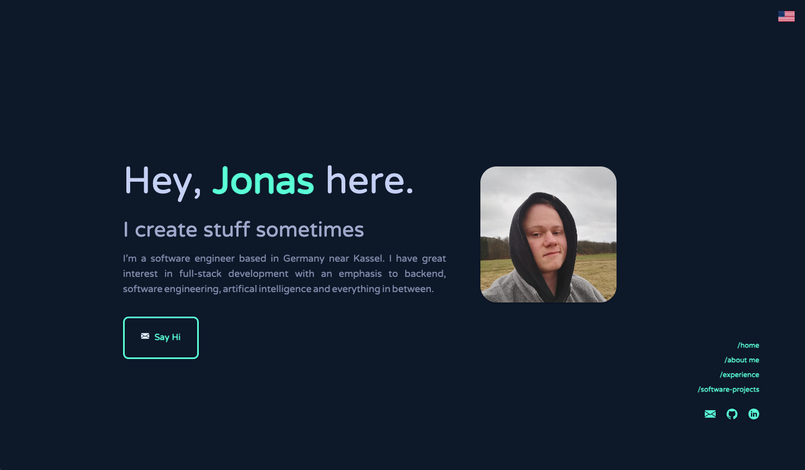

<h1 align="center">
   choan_portfolio
</h1>

<p align="center">
   The first iteration of <a href="https://portfolio-jonaswagner.vercel.app/" target="_blank">my Portfolio Website</a> built with Angular using Material UI.
</p>

<p align="center">
   
</p>

## 📝 Prerequisites

- Node.js and npm: https://nodejs.org/
- Angular CLI: https://cli.angular.io/

## 🛠 Installation

1. Clone the repository

   ```sh
   git clone https://github.com/choan312/choan_portfolio.git
   cd choan_portfolio
   ```

2. Install the dependencies

   ```sh
   npm install
   ```

3. Start the development server

   ```sh
   ng serve
   ```

## 🎨 Color Codes

| Color          | Hex                                                                |
| -------------- | ------------------------------------------------------------------ |
| Navy           |  `#0a192f` |
| Slate          |  `#8892b0` |
| Light Slate    |  `#a8b2d1` |
| Lightest Slate |  `#ccd6f6` |
| White          |  `#e6f1ff` |
| Green          |  `#64ffda` |

## Acknowledgments

Design inspired by [gazijarin](https://github.com/gazijarin)